# TP5 - Bases De Datos y Manejo De GitHub
#16.22 Informática Médica
## Integrantes del Grupo 2

- Abril Dománico - 60014
- Martín Lopez Trulos - 60139

## Profesores

- Carlos Lazzarino
- Ingrid Spessotti
- Eugenia Camila Berrino
- Aylin Vázquez Chenlo
- Melina Piacentino Castaño

**Fecha De Entrega: 05/06/2024**

## **PARTE 1:** Bases de Datos

### 1. ¿Qué tipo de base de datos es? 

Este tipo de base de datos es una base de datos relacional. Las bases de datos relacionales se utilizan para almacenar y gestionar datos estructurados y están organizadas en tablas que pueden estar relacionadas entre sí mediante claves primarias y foreign keys.

### 2. Armar el diagrama de entidad relación. 
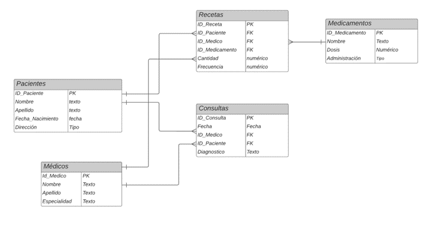

### Además comprobamos con el ERD de pgadmin.
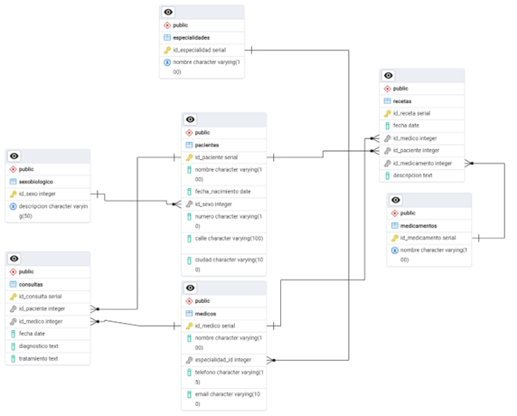

### 3. Considera que la base de datos está normalizada. En caso que no lo esté, ¿cómo podría hacerlo?

La normalización es el proceso de estructurar una base de datos de acuerdo con una serie de reglas para minimizar la redundancia de datos y mejorar la integridad de los datos. Dada la base proporcionada, se puede observar que cada tabla tiene una clave primaria única, y todas las columnas no clave dependen directamente de la clave primaria. No hay dependencias transitivas visibles. Por lo tanto se considera que no se requiere ninguna normalización adicional.

## **PARTE 2:** Bases de Datos

### 1. Obtener el nombre y la dirección de los pacientes que viven en Buenos Aires.

```
CREATE EXTENSION IF NOT EXISTS pg_trgm;
SELECT Nombre, Numero, Calle, Ciudad
FROM Pacientes
WHERE LOWER(Ciudad) = 'buenos aires'
   OR SIMILARITY(LOWER(Ciudad), 'buenos aires') > 0.4;
```
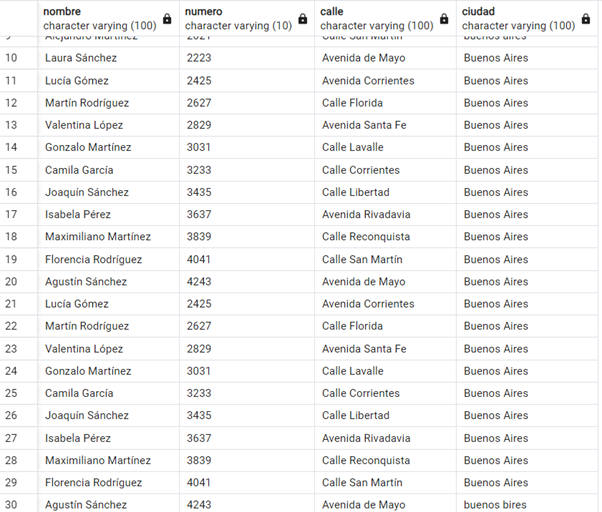


### 2. Obtener la cantidad de recetas emitidas por cada médico.

```
SELECT M.Nombre, COUNT(R.ID_Receta) AS Cantidad_Recetas
FROM Recetas R
JOIN Medicos M ON R.ID_Medico = M.ID_Medico
GROUP BY M.ID_Medico, M.Nombre;
```
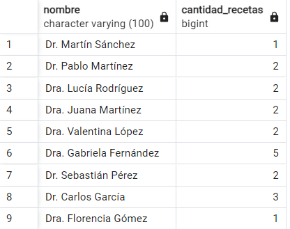

### 3. Obtener el nombre de los pacientes junto con la fecha y el diagnóstico de todas las consultas médicas realizadas en junio del 2024.

```
SELECT P.Nombre AS nombre_paciente, C.Fecha, C.Diagnostico, P.id_paciente
FROM Consultas C
JOIN Pacientes P ON C.ID_Paciente = P.id_paciente
WHERE C.Fecha >= '2024-06-01' AND C.Fecha < '2024-07-01';
```
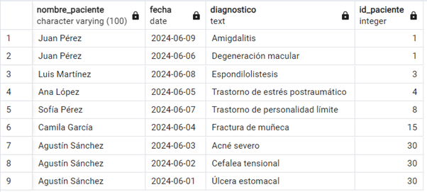

### 4. Obtener el nombre de los medicamentos prescritos más de una vez por el médico con ID igual a 2.

```
SELECT M.nombre AS Nombre_Medicamento
FROM Medicamentos M
JOIN Recetas R ON M.id_medicamento = R.id_medicamento
JOIN Consultas C ON R.id_paciente = C.id_paciente
WHERE R.id_medico = 2
GROUP BY M.nombre
HAVING COUNT(*) > 1;
```


### 5. Obtener el nombre de los pacientes junto con la cantidad total de recetas que han recibido.

```
SELECT P.Nombre AS Nombre_Paciente,  
       P.ID_Paciente AS ID_Paciente,
       COUNT(R.id_receta) AS Cantidad_Recetas
FROM Pacientes P
LEFT JOIN Recetas R ON P.id_paciente = R.ID_Paciente
GROUP BY P.ID_Paciente, P.Nombre;
```
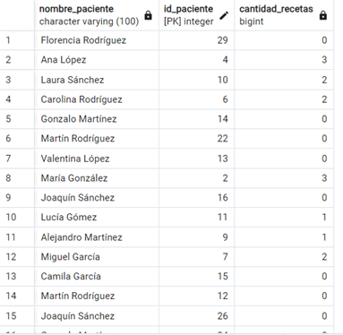

### 6.Obtener el nombre del medicamento más recetado junto con la cantidad de recetas emitidas para ese medicamento.

```
SELECT M.Nombre AS Nombre_Medicamento, COUNT(*) AS Cantidad_Recetas
FROM Medicamentos M
JOIN Recetas R ON M.id_medicamento = R.ID_Medicamento
GROUP BY M.id_medicamento, M.Nombre
ORDER BY COUNT(*) DESC
LIMIT 1;
```
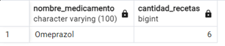

### 7. Obtener el nombre del paciente junto con la fecha de su última consulta y el diagnóstico asociado.

```
SELECT P.Nombre AS Nombre_Paciente, C.Fecha AS Fecha_Ultima_Consulta, C.Diagnostico
FROM Pacientes P
JOIN (
    SELECT ID_Paciente, MAX(Fecha) AS Fecha_Ultima_Consulta
    FROM Consultas
    GROUP BY ID_Paciente
    ) 
	Ultima_Consulta ON P.id_paciente = Ultima_Consulta.ID_Paciente
JOIN Consultas C ON Ultima_Consulta.ID_Paciente = C.ID_Paciente AND Ultima_Consulta.Fecha_Ultima_Consulta = C.Fecha;
```
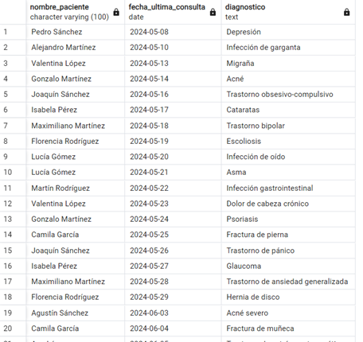

### 8. Obtener el nombre del médico junto con el nombre del paciente y el número total de consultas realizadas por cada médico para cada paciente, ordenado por médico y paciente.

```
SELECT 
    medicos.id_medico,
    medicos.nombre AS nombre_medico,
    pacientes.id_paciente,
    pacientes.nombre AS nombre_paciente,
    COUNT(consultas.id_consulta) AS total_consultas
FROM 
    consultas
JOIN 
    medicos ON consultas.id_medico = medicos.id_medico
JOIN 
    pacientes ON consultas.id_paciente = pacientes.id_paciente
GROUP BY 
    medicos.id_medico, 
    medicos.nombre, 
    pacientes.id_paciente, 
    pacientes.nombre
ORDER BY 
    total_consultas DESC, 
    medicos.id_medico,
    pacientes.id_paciente;
```
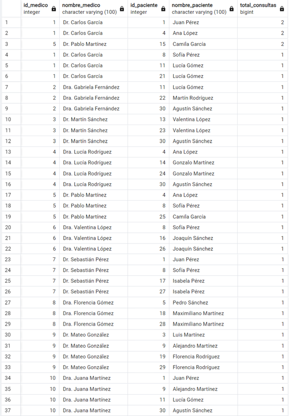

### 9.Obtener el nombre del medicamento junto con el total de recetas prescritas para ese medicamento, el nombre del médico que lo recetó y el nombre del paciente al que se le recetó, ordenado por total de recetas en orden descendente.

```
SELECT 
    medicamentos.nombre AS nombre_medicamento,
    COUNT(recetas.id_receta) AS total_recetas,
    medicos.id_medico,
    medicos.nombre AS nombre_medico,
    pacientes.id_paciente,
    pacientes.nombre AS nombre_paciente
FROM 
    recetas
JOIN 
    medicamentos ON recetas.id_medicamento = medicamentos.id_medicamento
JOIN 
    medicos ON recetas.id_medico = medicos.id_medico
JOIN 
    pacientes ON recetas.id_paciente = pacientes.id_paciente
GROUP BY 
    medicamentos.nombre, 
    medicos.id_medico, 
    medicos.nombre, 
    pacientes.id_paciente, 
    pacientes.nombre
ORDER BY 
    total_recetas DESC;
```
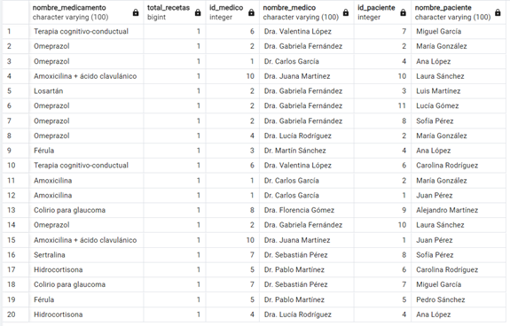

### 10.Obtener el nombre del médico junto con el total de pacientes a los que ha atendido, ordenado por el total de pacientes en orden descendente.

```
SELECT 
    medicos.nombre AS nombre_medico,
    COUNT(DISTINCT consultas.id_paciente) AS total_pacientes
FROM 
    consultas
JOIN 
    medicos ON consultas.id_medico = medicos.id_medico
GROUP BY 
    medicos.nombre
ORDER BY 
    total_pacientes DESC;
```
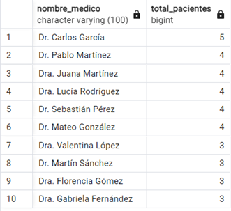